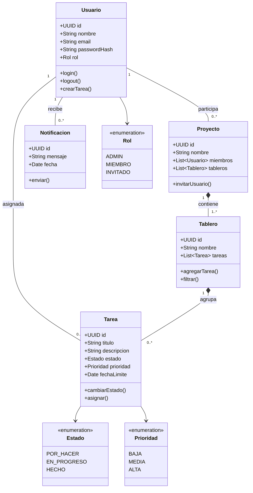

# Diseño: Diagrama de Clases

El modelo de dominio de **TaskFlow** se representa mediante el siguiente diagrama de clases UML.

## 1. Diagrama general

## 2. Descripción de las clases

### Usuario

Representa a una persona registrada. Contiene credenciales y un rol que determina sus permisos.

### Tarea

Unidad mínima de trabajo. Su ciclo de vida está controlado por el enum `Estado`.

### Tablero

Agrupación visual de tareas tipo Kanban. Cada proyecto puede tener varios tableros.

### Proyecto

Contenedor de nivel superior. Agrupa usuarios y tableros.

### Notificacion

Mensajes generados ante eventos relevantes (asignaciones, cambios de estado).

## 3. Relaciones clave

- **Usuario – Tarea:** 1 a N (un usuario puede tener muchas tareas asignadas).
- **Proyecto – Tablero:** composición (los tableros no existen sin proyecto).
- **Tablero – Tarea:** composición (las tareas pertenecen a un tablero).
- **Usuario – Proyecto:** muchos a muchos (representado con lista).

## 4. Patrones de diseño aplicados

| Patrón | Aplicación |
|--------|------------|
| Repository | Acceso a datos desacoplado de la lógica de negocio |
| Observer | Notificaciones ante cambios de estado |
| DTO | Transferencia de datos entre frontend y backend |
| Factory | Creación de tareas según tipo (normal, recurrente) |
