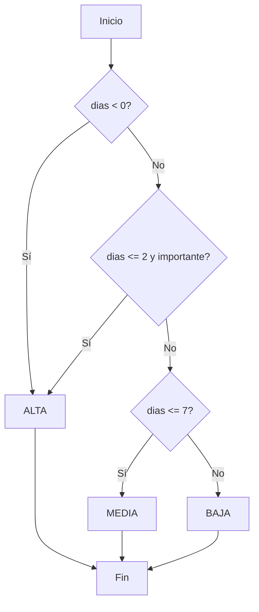

# Pruebas: Análisis de Caja Blanca

El análisis de caja blanca evalúa la estructura interna del código de **TaskFlow** para garantizar caminos lógicos correctos.

## 1. Objetivos

- Medir la cobertura de sentencias y ramas.
- Detectar caminos no probados.
- Verificar condiciones complejas.

## 2. Herramientas utilizadas

| Herramienta | Uso |
|-------------|-----|
| Jest | Framework de pruebas unitarias |
| Istanbul / nyc | Cobertura de código |
| SonarQube | Análisis estático |

## 3. Ejemplo de función a analizar

```typescript
function calcularPrioridad(vencimiento: Date, importante: boolean): Prioridad {
  const dias = diferenciaEnDias(new Date(), vencimiento);

  if (dias < 0) {
    return Prioridad.ALTA; // tarea vencida
  }
  if (dias <= 2 && importante) {
    return Prioridad.ALTA;
  }
  if (dias <= 7) {
    return Prioridad.MEDIA;
  }
  return Prioridad.BAJA;
}
```

## 4. Grafo de flujo



## 5. Complejidad ciclomática

- Nodos de decisión: 3
- Fórmula: `V(G) = decisiones + 1 = 4`
- Se necesitan **al menos 4 casos de prueba** para cubrir todas las ramas.

## 6. Casos de prueba derivados

| Caso | Entrada | Resultado esperado |
|------|---------|--------------------|
| CP-01 | vencimiento ayer | ALTA |
| CP-02 | vence en 1 día, importante=true | ALTA |
| CP-03 | vence en 5 días | MEDIA |
| CP-04 | vence en 15 días | BAJA |

## 7. Cobertura alcanzada

| Métrica | Valor | Objetivo |
|---------|-------|----------|
| Sentencias | 92 % | ≥ 80 % |
| Ramas | 88 % | ≥ 80 % |
| Funciones | 95 % | ≥ 80 % |
| Líneas | 91 % | ≥ 80 % |

## 8. Conclusiones

El módulo analizado cumple con los umbrales definidos en el RNF-05. Se recomienda mantener la cobertura en futuras iteraciones mediante integración continua.
